```{r, include=FALSE}
library(gt)
```

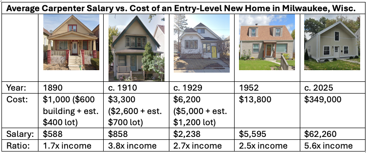

A traditional rule of thumb for buying a house is “3x income.” If your household income is \$100,000 (the thinking goes) you can afford a \$300,000 house. The wisdom of the 3x rule is debatable, but it usefully illustrates the crux of America’s housing crisis. A dwindling share of the population can afford to finance the construction of a new house.

Consider: the 50th percentile household in the U.S. had an [income](https://fred.stlouisfed.org/series/MEHOINUSA672N) of \$83,730 in 2024—the highest income on record, even adjusted for inflation. By the 3x rule, that household could afford a \$251,190 house. The average sale [price](https://www.census.gov/construction/nrs/current/index.html) of a new home in August 2024 was \$405,800. Just 16% of new houses sold in 2024 were priced below \$300,000. Data isn’t available to further breakdown those sub-\$300,000 prices, but I’m confident scarcely any were sold for \$250,000 or less. As I write this, Zillow shows just [one](https://www.zillow.com/homedetails/301-Ladd-Ln-Osceola-WI-54020/247571182_zpid/) developer in Wisconsin building detached single-family homes with a list price of \$250,000.[^1]

[^1]: Zillow also shows four standalone new houses in Wisconsin listed for less than \$250,000. They mostly resemble glorified garages.

In other words, by the traditional “3x rule,” the average American household can afford to buy a newly-built detached, single-family home in exactly one subdivision in Wisconsin.

The census concept “[households](https://www.census.gov/glossary/#term_Household?term=Household)” includes people who live by themselves. New housing affordability looks a little less dire when we look at statistics for “[families](https://www.census.gov/glossary/#term_Household?term=Family+household),” defined as at least two related people living together. Families increasingly consist of at least two wage earners, so the median family household income in 2024 was \$105,800. Following the 3x rule, this family could afford a \$317,400 house.

By this standard, at least some of new homes are affordable for the median family. In addition to the 16% of homes sold for less than \$300k in 2024, another 29% were sold for \$200-300k.

Still, the choices available to the median family have greatly diminished. Prior to 1980, the average family could afford the average house. The median new home price was consistently less than 3x the median family income. It surged past this line by the end of the 1980s, never to return. At the beginning of 2024, the 50th percentile new home price was 4.07x greater than the 50th percentile family income.

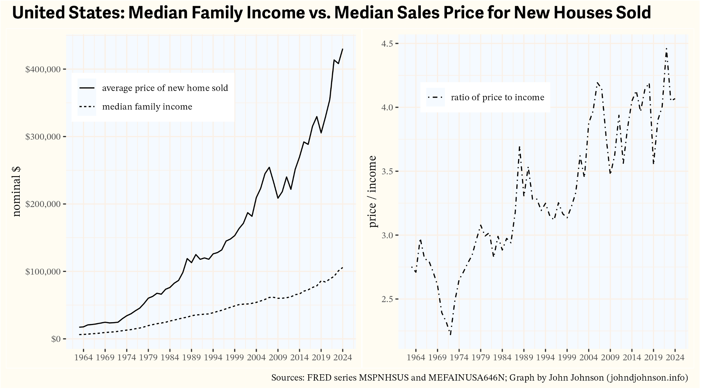 Official housing and income time series (like the ones graphed above) mostly begin in the 1960s or later. Most of Milwaukee’s [existing housing stock](https://github.com/jdjohn215/milwaukee-house-styles/tree/main)—the turn of the century cottages, the 1920s bungalows, the post-war cape cods and ranches—were built well before then. I wanted to understand how much it cost to build those houses and who could afford to buy them.

I chose to focus on modest, working class housing from each Milwaukee era, rather than grander middle and upper class homes. Before World War II, a common practice was to buy an empty lot on the city’s periphery and pay for the construction of a new house. To estimate these costs, I collected newspaper advertisements for vacant lots and looked up construction costs recorded on original building permits. After World War II, it was far more common to buy already-built homes, often directly from the builder, so I obtained list prices for new homes from Milwaukee *Journal* advertisements.

## The Late 19th Century

About 4% of the city’s existing houses are cottages, mostly built in the late 19th century. Some of them, like the cottage shown below on the right, were later converted into a duplex, by raising the first floor to accommodate a unit in the basement level. Cottages like these are found throughout neighborhoods near downtown, and they are especially common on the near south side.

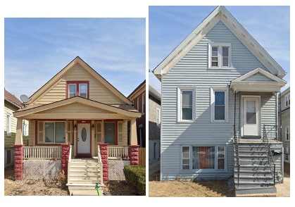

Building permits show that the house on the left cost \$600 to build in 1890. The house on the right cost \$500 in 1889 (it was not yet a duplex).^[Corroboration of these price points comes from an 1890 book published in Chicago, The Complete House Builder, which estimated that a cheap cottage on a posts could be built for $476. Plumbing would add an additional $175 and a foundation about the same.] Empty lots typically ranged in cost from \$250 to \$400 in residential subdivisions.^[Per my investigation of newspaper classifieds.]

To put that into context, here are the average wages for 15 common jobs in Milwaukee in 1890.

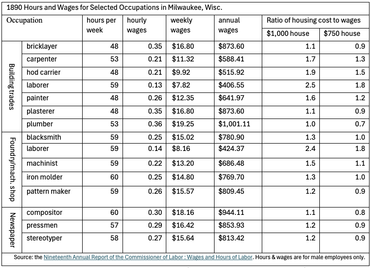

The best paid jobs on this list were plumbers ($1,001/yr) and compositors ($944), who laid out the type for newspapers. The worst paid were common laborers, who made $407 in the building trades and $424 in foundries and machine shops. Compare these wages to the cost of the cottages shown above. For plumbers, an average salary was basically equal to the cost of a modest cottage. For a laborer in the building trades, a modest cottage might range from 1.8x to 2.5x his salary.

## Circa 1910

The quality and cost of housing increased in the early 20th century. These photos show six houses on the 1200 block of South 36th Street in Milwaukee’s Silver City neighborhood. They were all built in 1908 or 1909. Their building permits list construction costs of, from left to right: $2,600; $4,000; $2,100; $2,200; $2,100; and $3,000.

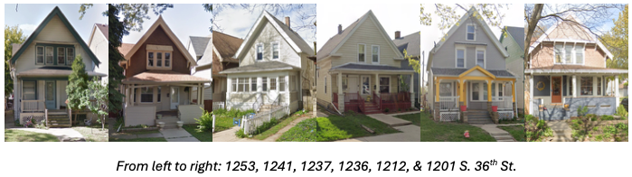

Newspaper ads from the time period show empty residential lots usually selling for $350 to $1,025. A common scenario might be building a $2,700 house on a $600 lot, for a total cost of $3,300.^[Upper/lower duplexes were also commonly built in the 1910s. I looked up the construction cost of 9 duplexes built between 1907 and 1910 on the 2800 block of North Murray Avenue. They ranged in cost from $4,500 to $6,000 with an average of $5,356. Presumably, most families who built one of these houses also collected rent from the other unit.] Here is how that cost compares with the wages paid to common Milwaukee professions in 1909. The wage numbers are from union wage scale data published by the Bureau of Labor Statistics.

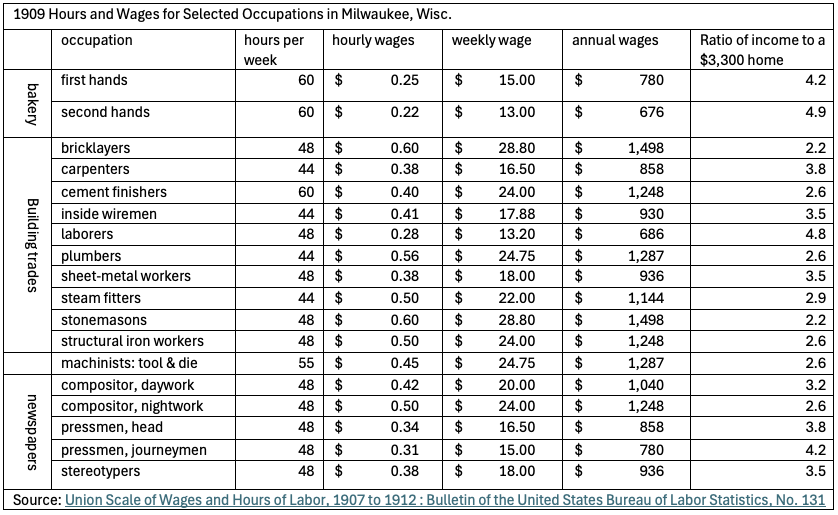

Relative to 1890, this table shows diminished affordability—although, it’s important to note that the quality of the housing being purchased had increased as well. The most highly paid jobs in this list are bricklayers and stonemasons. For them, a $3,300 house would cost 2.2x their annual income. The lowest paid jobs are bakery second-hands and building trades laborers, for whom a $3,300 house would cost 4.9x and 4.8x annual salary, respectively.

## The 1920s

Most of the houses built in Milwaukee during the 1920s were bungalows (including both single family homes and duplex variants). Bungalows came in various shapes and sizes and could be built out of wood, stone, or brick. But the cheapest bungalows (often sold in kits) were quite affordable. The four bungalows pictured below are in the former Town of Lake, which was annexed by Milwaukee in 1954. They were built in 1929 and 1930 at a cost, according to their building permits, of $5,000 for the first three and $5,500 for the fourth.

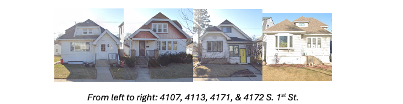
Newspaper ads from the period list many empty lots at prices ranging from $750 to $1,600. Taking a lot price of $1,200 would put the total cost of a basic duplex at $6,200. Here is how that cost compares to the 1928 wages of some common Milwaukee jobs.

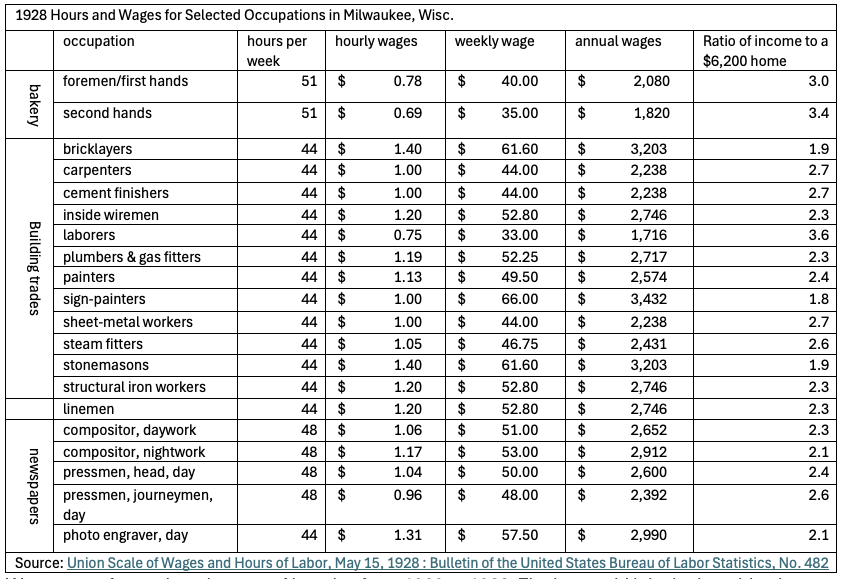

Wages grew faster than the cost of housing from 1909 to 1928. The best paid jobs in the table above were sign-painter, bricklayer, and stonemason. For these workers, our $3,300 bungalow would cost less than twice their annual income.

The worst paid workers on this list from 1928 were once again building trades laborers and second-hand bakers. For these workers, the cost of our new bungalow works out to 3.6x or 3.4x annual income.

## The 1950s

Little new housing was built during the Great Depression or World War II. After the war, there was a voracious need for new housing across the country. Milwaukee met that demand mainly by building thousands of modest cape cod and ranch style single family homes on the northwest and southwest sides of the city.

The January 31, 1952 Milwaukee *Journal* includes many listings for new homes, with prices for simple 2 and 3-bedroom models ranging from $11,780 to $16,300.

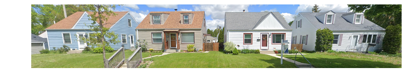

For $14,000, a buyer would be able to choose between a variety of houses across many neighborhoods. Here is how that cost compares to 1952 wages for common Milwaukee jobs.

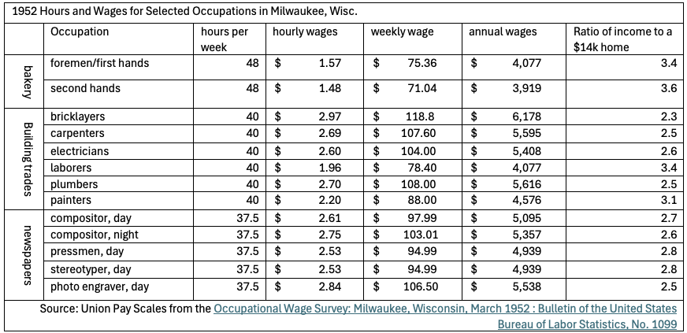

Bricklayers were once again the best paid job in this data. For a bricklayer, a $14,000 house would cost 2.3x salary. The worst-paid jobs were bakery second hands and building trades laborers. A $14,000 house would cost 3.6x and 3.4x their annual salary, respectively.
The 2020s

Today, wage data is easy to come by. In [2024](https://www.bls.gov/oes/tables.htm), the median full time salary for a Milwaukee plumber was $82,080. It was $80,320 for bricklayers; $76,820 for electricians; $62,260 for carpenters; $55,420 for construction laborers; $53,010 for machinists; and $50,610 for painters.
Housing costs are less clear, because very few new single family homes get built without government or philanthropic subsidies. In any given year, Habitat for Humanity is responsible for most of the detached, single-family homes built in the city.

As I write this, Zillow shows just 6 new, single-family homes for sale inside city limits.

Some of them reflect the costs of standard contemporary housing. One, a 2,044 sq. ft. house near St. Francis, is listed for $585,000. Two $1,600 sq. ft. houses on the border with Brown Deer are listed for a little over $400,000. Empty lots like these—where prevailing home prices can justify market rate construction—[are rare](https://johndjohnson.info/posts/2025/milwaukee-cost-of-construction.html).

The cheapest apparently unsubsidized house is a $349,000 1,700 sq. ft. project by Lange Urban Sustainable Homes, a local company with a patented modular plywood [assembly process](https://urbanmilwaukee.com/2024/08/13/northside-home-built-with-radically-new-housing-model/). By “unsubsidized” I mean that the company appears to be attempting to at least recoup their construction costs in the sale of the home. The land itself was sold by the City of Milwaukee to Lange for $1.

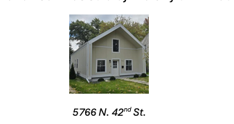

From everything I’ve seen, $350,000 seems like a reasonable (though possibly low) estimate of what it costs to build a modest single-family home today, excluding the cost of land, which is available practically for free in Milwaukee’s cheapest neighborhoods. This table shows a $350,000 housing cost as a ratio of median incomes for selected professions. It compares this 2024 ratio with ratios I’ve calculated for 1890, 1909, 1928, and 1952.

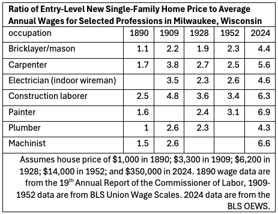

The cost of a modest new house was attainable on almost all of these salaries in the 1920s and 1950s. Today, none of them are, at least judging by the 3x rule. An average Milwaukee construction laborer’s wages rose by a factor of 136, from $407 in 1890 to $55,420. Meanwhile, the cost of a modest new house grew by a factor of 350.

One explanation for why housing costs have grown so much is [Baumol’s cost disease](https://www.sciencedirect.com/science/article/pii/S016518891730249X). Over the last century, many parts of the economy have grown enormously in productivity. But housing hasn’t, at least not in relative terms. The labor required to build a house is still much the same as it was 100 years ago. The historical wage records I researched for this article inadvertently demonstrate this. Many of early 20th century job categories associated with manufacturing and printing literally no longer exist (e.g. “newspaper photo engraver”). But nearly all of the jobs from the building trades category remain consistently present. You still need a plumber, an electrician, carpenters, painters, and laborers to build a house.^[Sometimes the names change, e.g. “inside wiremen” became “electrician.”]

This is why I’m skeptical of solutions to America’s housing affordability crisis that focus on zoning and land use regulations. Those are important. But even when land is free, the cost of construction is increasingly difficult to afford. When Milwaukee was built, a new house could be feasibly financed with the salaries of many workers. Now, sometimes two salaries isn’t enough.
