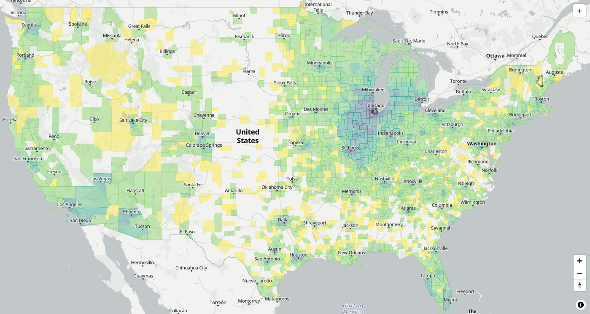
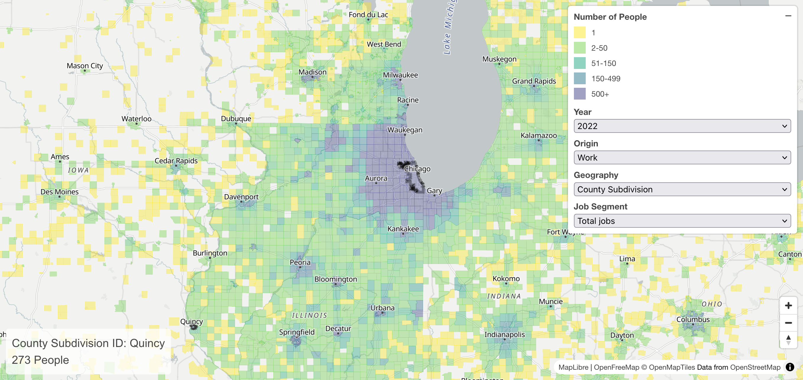
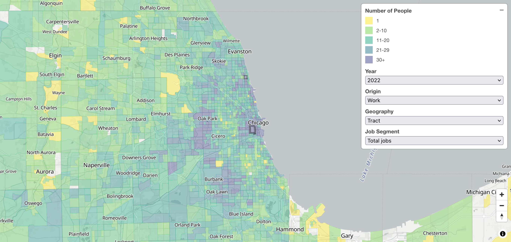
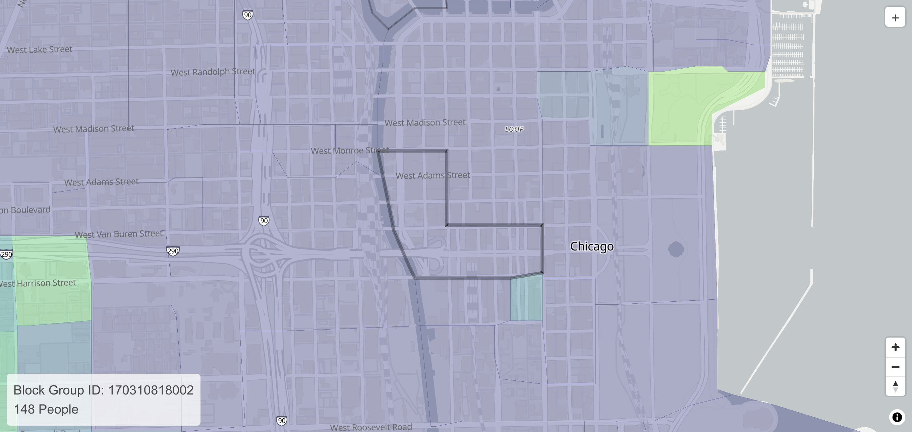
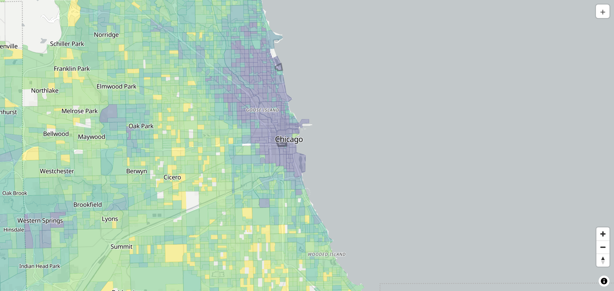
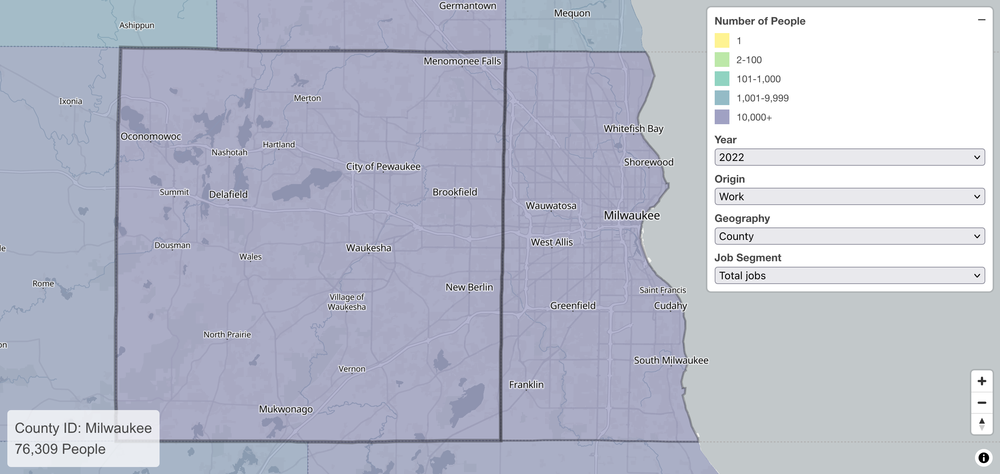
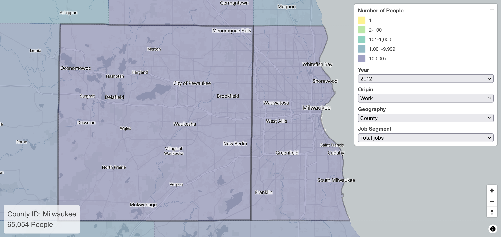

```{r setup, include=FALSE}
knitr::opts_chunk$set(warning = F, message = F, echo = F)
```

```{=html}
<iframe height="500" src="https://lodesmap.com/?id=550790903002&origin=w_geo&geography=county&countySubdivisionId=5507953000&year=2022#4.8/41.84/-82.25" title="LODES Map" width="100%" data-external=1></iframe>
```

This map visualizes where Americans live and work. On loading this page, it shows the home locations of people who work in Milwaukee County, Wisconsin. Change the origin to "home" to view the reverse--the workplaces of people who *live* in Milwaukee. Hover over a county to reveal the exact number of jobs. Click on any other county to create its map instead.

LODESmap makes it easy to save and share maps because every map comes with a custom URL. Send that URL to someone else, and they'll see the same map as you. [Here, for instance, is the link to the map of Milwaukee County workers](https://lodesmap.com/?id=550790903002&origin=w_geo&geography=county&countySubdivisionId=5507953000&year=2022#4.8/41.84/-82.25).

Data is currently available for 2002 through 2022. Not every state's data is available in each year.

Use the Geography filter to create maps for smaller geographies.

Use the Job Segment filter to filter workers by age, wage, or industry type.

::: {.callout-note appearance="simple" collapse = true}

## About the data

This data comes from the [US Census Bureau's LODES data program](https://lehd.ces.census.gov/data/), which collects information on employee addresses and workplaces from state unemployment insurance programs. It includes all workers who are on a normal payroll, but it does not include self-employed people. Every job is paired with a worksite, even if the employee works remotely. In this way, the LODES data can reveal remote workers in distant city-pairs. See the official LODES documentation for further details.

Not every state's data is available in each year. In 2022, data is missing for jobs located in Michigan, Mississippi, and Alaska.

The source data is published at the census block level and can be explored using the Census Bureau's [On The Map tool](https://onthemap.ces.census.gov/). We made our tool to quickly facilitate easier explorations of common aggregations of this data.

We will add data for 2023 shortly after it is released by the Census Bureau, which we anticipate will occur in September 2025.

:::

LODESmap allows you to swiftly move between higher and lower levels of aggregation.

:::{.cr-section}

:::{#cr-cookcounty}

:::

:::{#cr-chicago-work}

:::

:::{#cr-chicago-tract1}

:::

:::{#cr-chicago-bg1}

:::

:::{#cr-chicago-bg2}

:::

:::{#cr-milwaukee-to-waukesha}

:::

:::{#cr-milwaukee-to-waukesha-2012}

:::

:::{#cr-microsoft-2002}

:::

:::{#cr-microsoft-2012}

:::

:::{#cr-microsoft-2022}

:::

:::{#cr-amazon-2022}

:::

:::{#cr-seatac-2022}

:::

This map shows where everyone who worked in Cook County, Illinois in 2022 lived. Every job is connected to a worksite, regardless of whether the worker commutes or not, so far-flung locations likely show remote workers. @cr-cookcounty

By changing the Geography from "county" to "county subdivision" we can see where everyone lives who works in the City of Chicago, specifically. @cr-chicago-work

Hover over a place to reveal its name and number of jobs. 273 people who live in Quincy, IL work in Chicago. [@cr-chicago-work]{pan-to="99%,-80%" scale-by="3"}

[@cr-chicago-work]{pan-to="10%,10%" scale-by="2"}

Switching to census tracts shows even more detail. Many people work in the selected downtown Chicago tract. The greatest concentrations, shown in purple, are near downtown and in an outer ring of suburbs and far-flung neighborhoods. @cr-chicago-tract1

Block groups provide even more detail. Here is the block group which includes the Willis (formerly, Sears) Tower. @cr-chicago-bg1

The Willis Tower and surrounding buildings draw most of their employees from the northern half of Cook County. @cr-chicago-bg2

The tool also makes it easy to measure flows over time. This map shows that 76,309 Waukesha County jobs were held by Milwaukee County residents in 2022. @cr-milwaukee-to-waukesha

Changing the year option to 2012 shows that a decade prior, the number was 65,054 (11,255 fewer). @cr-milwaukee-to-waukesha-2012

LODESmap can show the growth of major employers over time. Here is the map of employees in the block group covering the Redmond, Washington **headquarters of the Microsoft Corporation in 2002**. @cr-microsoft-2002

And in 2012. @cr-microsoft-2012

And in 2022. @cr-microsoft-2022

LODESmap reveals the residential economic stratification of metro areas. This map shows the homes of everyone who works in census tract 5507953000, in Seattle's central business district, across the street from Amazon's Doppler Building. @cr-amazon-2022

And here are the homes of the employees at SeaTac International Airport. @cr-seatac-2022

:::

LODESmap reveals a practically uncountable number of data points. These are just a few examples. Explore it yourself: [https://lodesmap.com](https://lodesmap.com)

