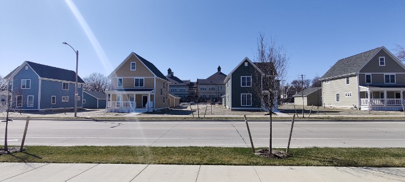
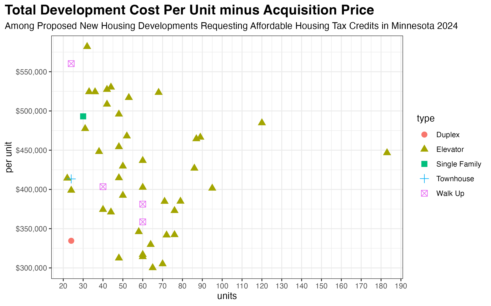
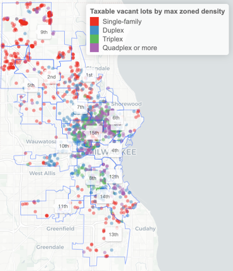

```{r, include=FALSE}
library(gt)
```



The photo above shows four of Milwaukee’s newest houses. They were built in 2024 in the Midtown neighborhood by the large affordable housing developer Gorman and Co.  Gorman’s goal for the project was to “serve as a proof of concept that market-rate, owner-occupied hous[ing] can work in the area,” according to reporting by Urban Milwaukee.

Instead, it looks like the original developers will lose their shirts on this project—yet another example of how impractical market rate construction remains in most of Milwaukee.

Back in 2021, Gorman expected the houses to cost around $250,000 to build, with sale prices somewhere under $200,000. To make up the difference, the city created a TIF district contributing $75,000 per home, funded by future property taxes from these new homes.
The market changed dramatically in the early 2020s with construction inflation far outstripping the consumer price index. Those “250k” houses wound up costing “approximately $400,000 to build” according to a Gorman official speaking near the project’s competition in August 2024.

Reflecting the 60% increase in costs, the houses originally went on the market at listings of $359,900 and $369,900 (for the two different floor plans). 324 days after the initial listing, the first home finally sold on April 4, 2025. The closing price: $281,000, 24% less than the initial asking price, which was itself below the reported development cost.

## How much does new construction really cost?

It can be tough to find detailed, current, and public information about construction prices. Recently, I acquired the applications for all 47 proposed developments applying for affordable housing tax credits in Minnesota during 2024. These applications include a detailed development budget with dozens of line items for specific costs. I’ve requested the same information from Wisconsin but have not received it. Some legal fees likely vary between the states, but I expect development costs to be basically similar between Minnesota and Wisconsin.

This table shows a simple cost breakdown across all the projects. I’ve removed acquisition costs from these calculations, because many affordable housing projects get the land for free. Leaving aside any land costs, the median housing unit cost $414k to build. Of that cost 75% went to the construction budget, 10% to the developer, 7% in professional fees (architect, permitting, legal, etc.), and 6% to financing costs (insurance, interest, etc.).

```{r, echo=FALSE}
structure(list(name = structure(1:6, levels = c("Total Construction Costs", 
"Developer Fee", "Professional Fees", "Financing Costs", "Non-Mortgageable Costs", 
"Total Development Costs"), class = "factor"), value = c(307212.33358421, 
41631.5789473684, 27143.719375, 24404.6168190875, 7187.5, 414308.210526316
)), row.names = c(NA, -6L), class = c("tbl_df", "tbl", "data.frame"
)) |>
  gt(rowname_col = "name") |>
  fmt_currency(columns = 2, decimals = 0) |>
  cols_label(value = "per unit") |>
  tab_style(style = list(cell_borders(sides = "top"), cell_text(weight = "bold")),
            locations = list(cells_stub(rows = 6), cells_body(rows = 6))) |>
  tab_style(style = cell_text(align = "right"),
            locations = cells_stub(rows = 1:5)) |>
  tab_header(title = "Median Budgeted Development Costs, Excluding Acquisition",
             subtitle = "among 47 projects applying for affordable housing tax credits in Minnesota in 2024") |>
  tab_style(style = cell_text(weight = "bold"),
            locations = cells_title("title")) |>
  tab_options(table.width = 400)
```

The next graph shows the per-unit total cost vs. the number of units in the development for each project. There is a wide range in costs per project, but generally, larger projects are cheaper. Projects with 50 or more units had a median per unit price of $389,000, compared with $454,000 for those with fewer than 50 units.

The absolute cheapest proposed development was a 65-unit senior-housing apartment building with a per-unit cost of $300,000. Any family-sized housing development inevitably cost more.

How do total construction prices translate to monthly rents? Imagine if you had to pay off a $300,000 unit at a fixed 6% interest rate over 30 years. The principal, interest, and taxes alone would be $2,415 a month. For the median $414,000 unit, the bare minimum PITI and tax payment would be $3,333. In reality, costs are even higher. Occupancy is always less than 100% and apartment developers must budget for repairs, maintenance, and insurance.



## Where can the market afford to build new housing in Milwaukee?

This is one of the most underappreciated facts about housing in cities like Milwaukee. We don’t build housing because, in many (if not most) places, you cannot sell a new house for what it costs to build it. And without significant subsidizes, you cannot charge the rents required to finance the construction of a market-rate apartment building.

Let’s take $350,000 as the bare minimum price required to build a standard detached, single-family home. Citywide, just 7% of houses are worth this much.^[I’m using the 2024 assessed value and adjusting it by the Wisconsin Department of Revenue’s 0.9024 equalized assessed value ratio for the City of Milwaukee.] This improves to 43% among houses built since 2000. Still, most ‘modern’ houses in the city are not worth what it would cost to replace them.

This simple fact, in most neighborhoods houses cost more to build than you can sell them for, explains why the city has so many empty lots. In total, I count 1,500 non-tax-exempt empty lots where you could build a house right now under existing land use rules.  38% of those lots allow single family development under the existing rules, 44% duplexes or triplexes, and 17% quadplexes or more. The quadplex-eligible empty lots are overwhelmingly in the poorest areas of the city. I count 150 lots in just the 6th and 15th aldermanic districts which a private developer could buy right now and build a quadplex on by-right.



This is the basic conundrum: vacant parcels are common in neighborhoods where prevailing values are far below the level needed to finance new construction. Where home values are high enough to finance new construction, buildable lots are scarce. While it’s possible that developers could tear down existing houses to build new ones, this is practically unheard of in Milwaukee, even in neighborhoods where denser development is already legal. 

For example, there are over 3,500 single family homes which could be replaced with a quadplex under existing zoning and lot size rules.^[I calculate this based on the lot’s current zoning classification and its lot size. Some lots may have idiosyncratic dimensions which further reduce the allowable density.] But I cannot find a single instance of a quadplex replacing a single family home in my parcel records going back to 1990.

## Accessory Dwelling Units

For these reasons, I’m most [optimistic about accessory dwelling units](https://law.marquette.edu/facultyblog/2024/07/how-zoning-reform-could-reverse-population-loss-in-many-milwaukee-neighborhoods/) as a way to add housing units in Milwaukee. They are cheaper to build and can fit in those neighborhoods of the city where property values are highest. 

Also, ADUs are nothing new for Milwaukee. I count about 1,200 city lots classified as a “single family” or “duplex” but which hold multiple residentially buildings. Sometimes called “carriage houses,” they are almost entirely in the older neighborhoods surrounding downtown.

According to this 2025 analysis by [Angi](https://www.angi.com/articles/how-much-do-adu-costs.htm), the home contractor marketplace, the typical ADU costs $180,000 to build, with prices ranging between $40,000-$360,000. Costs are cheaper for internal basement or garage conversions and higher for new construction.

I wanted to know how many homeowners in Milwaukee might be able to afford costs in this range, so I modeled the home equity of every local homeowner as of January 2025.^[I have data on the purchase date and price of every owner-occupied house in the city. To calculate accrued equity, I subtract the owner’s modeled remaining principal from the 2024 equalized assessed value of the property. I model remaining principal by assuming that the owner paid 5% down, received a 30-year fixed-rate mortgage at prevailing interest rates, and has stayed current on their payments without refinancing. Obviously, individual circumstances will vary from the average predicted by the model.] Citywide, the median homeowner has accrued $128,000 in home equity. 66% have at least $100,000 and 26% have $180,000 or more. In total, I estimate 18,000 Milwaukee households have enough home equity to finance the average cost of an ADU.

How many would actually do it? I don’t know. In Seattle, where ADUs are far more expensive, they still permit close to 1,000 a year. Right now, in Milwaukee, we’re averaging fewer than 50 new single family homes or duplexes across the entire city in a typical year. We lose about the same number of units to conversions of duplexes into single family homes. Even a small number of people choosing to build ADUs would be a meaningful change from the status quo.

