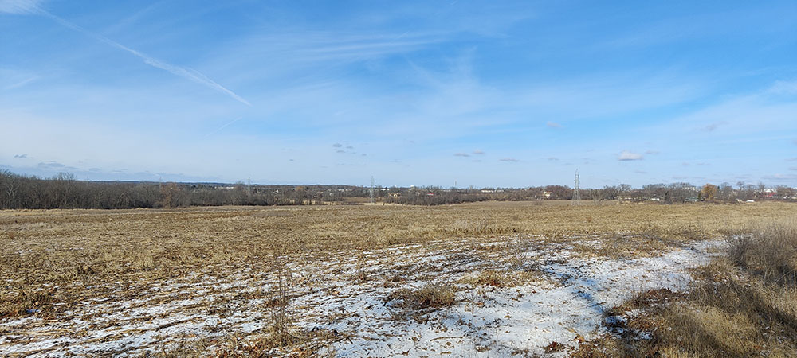

*A version of this post first appeared on [A Wealth of Nature](https://awealthofnature.org/where-is-milwaukee-countys-remotest-point/).*

The farthest one can travel from a road in Milwaukee County is 786 meters, or just under half a mile. Whether this seems a large or small number, I leave to your judgment. When I visited this point with a few friends on a bright January morning, we never fully escaped the sound of passing cars. With every particularly noisy reminder, someone would jokingly complain, “I thought you said this was far from a road,” to which I would argue that the word farthest implies nothing about absolute distance.

To me, it’s remarkable that such a (debatably) remote point exists at all in Milwaukee, the only county in Wisconsin where not a single acre remains unincorporated. By my calculations, there are about 3,900 uniquely-named roads in Milwaukee County covering roughly 4,000 linear miles. 786 meters is almost precisely the distance from City Hall to the Milwaukee Art Museum. Imagine standing on a point with not a single bit of pavement—or human structure—within that distance of you in any direction.

In this instance, you should be imagining yourself standing on the edge of a farm field, because that is where Milwaukee County’s remotest point falls—a cornfield owned by the Parks Department. The field is in Franklin, exactly halfway between Oakwood and County Line roads, roughly on line with South 42nd street, if it extended that far south, which it doesn’t.

To reach our point, a forester friend and I parked in the empty Oakwood Golf Course parking lot and walked west on Oakwood Road. Despite its generally rural aspect, the road is punctuated at regular intervals by shiny fire hydrants, installed, perhaps, in anticipation of future development. Plunging into a field, we followed a little-used farmer’s two-track path around the edge of one field, across a waterway, and through a second. We then entered a third field and followed a hedgerow all the way to our destination.

We stood on the edge of a southern mesic forest of mainly maple, hickory, and cherry, with a prickly ash understory. It had been lightly logged at some point in the last couple decades and competition for the exposed sky was fierce between the more mature stands. My forester friend, whom I owe for these botanical observations, speculated that someone tried to harvest the ash before the emerald ash borers got to it.

West of the forest, the farm field fell in a shallow descent toward the floodplain of the Root River, flowing on its way to Racine and Lake Michigan. It appears the most recent cultivation of this field has followed no-till practices.

All of the fields we passed through are part of a 3.3-square mile contiguous swathe of county park land in the southwestern quadrant of the county. Little of it is developed into official parks and more than a few acres remain cultivated farmland.

Shortly after my visit, [UrbanMilwaukee reported](https://urbanmilwaukee.com/2025/01/20/mke-county-parks-restoring-native-prairie-forest-on-former-agricultural-land/) that the county had received a federal grant funding the restoration back to prairies and wetlands of the very fields I walked through. Given the uncertainty around federal grants, I do not know if this specific project will come to pass as scheduled. Still, the plan is a good one. Milwaukee’s remotest point is beautiful even as a stubbly field, but I hope to see prairie flowers there instead one day. Sometimes conservation, I reflected on that hike, includes setting aside land in the faith that future generations will better know what to do with it.

